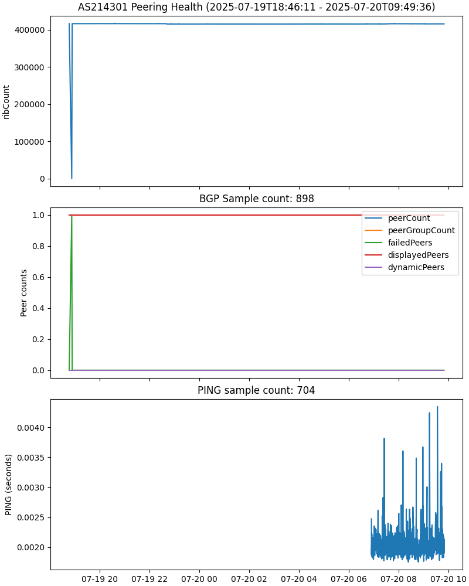

# FRRSD("Free-range Routing Summary Dump") Daemon
frrsdd is a simple python module written to collect and plot BGP peering health
and ping data locally on the router.

The BGP summary and ping data are polled periodically and pushed to the
PostgreSQL DB running on the same physical host.

Disclaimer: **NOT SUITABLE FOR PROD**

At the moment, these scripts are for my personal use only. I was told to collect
some data if I wanted to prove that I was actually having connectivity issues.

For a set up better suited for most use cases, see [#On some of the design
decisions](#on-some-of-the-design-decisions).

Cron job scripts not included.

## The pipeline
### frrsd module
Get BGP summary from FRR in JSON format by running the command.

```sh
vtysh -uc 'show bgp summary json'
```

Then insert the data to the tables.

```postgresql
INSERT INTO "bgp-unicast" ( ... );
INSERT INTO "bgp-peers" ( ... );
```

Do tcping on `1.1.1.1` port 443(https://one.one.one.one/) 4 times. Insert the
result to the table.

```postgresql
INSERT INTO "ping" ( ... );
```

Reiterate after 60 seconds of sleep.

### frrsdplot module
Pull the recent 1 day worth of data from the DB.

```postgresql
SELECT ... FROM ... WHERE
	"ts" >= timezone('utc', now()) - make_interval(days => 1)
```

And plot using `matplotlib`.



See it in action: https://cdn.snart.me/as214301/

## On some of the design decisions
### Use of TCP ping
TCP SYN, SYN+ACK is the only platform independent way to do ping. The only way
to implement ICMP ping in a platform-agnostic way is using a raw socket, which
is a privileged API. This is why `ping` command used to require root
historically.

Most platforms like Linux provides ICMP socket. That's why you we don't have to
`sudo` to `ping` anymore, but whether the higher level programming languages
exposes the API(ICMP socket) is another issue I just won't get into. That's why
frrsd does tcping.

What's measured in tcping is the RTT of SYN and SYN+ACK plus some userspace
scheduling and context switching overhead, which is normally measured in sub-ms.
It's good enough. Not that different from the traditional ICMP echo and reply.

### Why not use Prometheus?
Because: unstable upstream and memory footprint

Modern routers still don't come with bags of memory. A few gigs of RAM is still
enough for full v4 and v6 BGP tables. Throwing a memory hungry app on a busy
router is probably a bad idea in the first place.

Even if the router had no memory constraints, due to the nature of the problem
being troubleshooted/solved here, Prometheus's poll-and-store architecture
creates another problem.

1. The problem is probably at the provider's L2 fabric
2. Could make a beefy instance to host Prometheus: but then again, I have no
   control over tenancy
3. Can't dump the data over the internet either, for that reason

So the data had to be stored on the BGP host. The whole SQL dumping and plotting
business only takes just under 100MB of RSS.

### How it's usually done
1. FRR routers running [frr_exporter](https://github.com/tynany/frr_exporter) on
   the side
1. A Prometheus VM/BM polling metrics from the frr_exporter processes in the L2
   fabric
